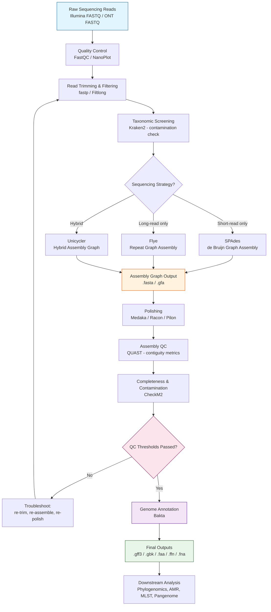

# bacterial-bioinformatics-guide
A modular, production-grade guide &amp; pipeline workflow for bacterial de novo assembly, annotation, and downstream comparative genomics.
# 🧬 Module 1: Bacterial De Novo Assembly & Annotation Pipeline


> Part of the **Bacterial Bioinformatics Reference Guide & Course** — a modular, production-grade curriculum for building genome-scale bacterial analysis pipelines from raw reads to biological insight.

---

## 📑 Table of Contents

1. [Module Overview](#module-overview)
2. [Workflow Map](#workflow-map)
   - [Visual Workflow (Mermaid)](#visual-workflow-mermaid)
   - [Text Workflow Description](#text-workflow-description)
3. [Biological Context & Senior Interview Scenarios](#biological-context--senior-interview-scenarios)
   - [Real-World Applications](#real-world-applications)
   - [Senior-Level Interview Questions & Traps](#senior-level-interview-questions--traps)
4. [Step-by-Step Technical Execution Table](#step-by-step-technical-execution-table)
5. [Practical Hands-On CLI Walkthrough](#practical-hands-on-cli-walkthrough)
   - [1. Raw Read Quality Control](#1-raw-read-quality-control)
   - [2. Adapter & Quality Trimming](#2-adapter--quality-trimming)
   - [3. Taxonomic Screening & Contamination Check](#3-taxonomic-screening--contamination-check)
   - [4. Hybrid / Long-Read / Short-Read Assembly](#4-hybrid--long-read--short-read-assembly)
   - [5. Assembly Polishing](#5-assembly-polishing)
   - [6. Assembly Quality Assessment (QUAST)](#6-assembly-quality-assessment-quast)
   - [7. Completeness & Contamination (CheckM2)](#7-completeness--contamination-checkm2)
   - [8. Genome Annotation (Bakta)](#8-genome-annotation-bakta)
6. [Technical QC Metrics & Interpretation](#technical-qc-metrics--interpretation)
7. [Common Pitfalls & Troubleshooting](#common-pitfalls--troubleshooting)
8. [Module Summary](#module-summary)

---

## Module Overview

This module builds a **production-grade bacterial de novo assembly and annotation pipeline**, covering the three dominant sequencing strategies used in clinical, public health, and research microbiology labs today:

| Strategy | Typical Chemistry | Assembly Philosophy |
|---|---|---|
| **Short-read only** | Illumina (NovaSeq, MiSeq) | High per-base accuracy, but struggles across repeats (rRNA operons, IS elements) → fragmented assemblies |
| **Long-read only** | Oxford Nanopore (ONT), PacBio | Resolves repeats and yields circularized chromosomes/plasmids, but historically higher raw error rate |
| **Hybrid** | Illumina + ONT | Combines long-read contiguity with short-read accuracy — the current gold standard for closed bacterial genomes |

By the end of this module, you will understand not just *which command to run*, but **why each tool exists at that specific point in the pipeline**, what biological artifact it is correcting for, and how to defend your pipeline design decisions in a senior technical interview or a peer-reviewed methods section.

> [!NOTE]
> This module assumes a **single bacterial isolate** (pure culture), not a metagenomic sample. Metagenomic assembly (binning, MAGs) is covered in a later module and requires a fundamentally different assembly graph strategy.

---

## Workflow Map

### Visual Workflow (Mermaid)



### Text Workflow Description

| Stage | Purpose | Decision Point |
|---|---|---|
| **1. Raw Reads** | Starting material — Illumina paired-end and/or ONT long reads | N/A |
| **2. QC** | Establish baseline read quality, GC content, duplication, adapter content | N/A |
| **3. Trimming** | Remove adapters, low-quality bases, short/chimeric reads | N/A |
| **4. Taxonomic Screening** | Confirm species identity, detect cross-contamination before wasting compute on assembly | **Stop pipeline if contamination >5–10%** |
| **5. Assembly** | Reconstruct the genome from reads using the appropriate graph algorithm | **Branches by sequencing strategy** |
| **6. Polishing** | Correct residual errors, especially in long-read-derived consensus sequences | N/A |
| **7. Assembly QC** | Quantify contiguity (N50, L50, contig count) and compare to reference | **Feedback loop if metrics fail** |
| **8. Completeness/Contamination** | Confirm the assembly represents a complete, single-organism genome | **Feedback loop if thresholds fail** |
| **9. Annotation** | Predict genes, CDS, rRNA/tRNA, and functional elements | N/A |
| **10. Outputs** | Structured files for downstream comparative genomics, AMR screening, phylogenetics | N/A |

---

## Biological Context & Senior Interview Scenarios

### Real-World Applications

- **Outbreak Tracking & Genomic Epidemiology**: Public health labs (e.g., PulseNet, GHRU) assemble bacterial isolates (*Salmonella*, *Listeria*, *E. coli* O157:H7) to build high-resolution SNP phylogenies for outbreak source attribution. Assembly quality directly determines SNP-calling reliability.
- **Reference Genome Construction**: Building a finished, closed reference genome (chromosome + plasmids) for a novel isolate or strain used in downstream comparative studies, requires hybrid assembly to resolve rRNA operons and mobile genetic elements.
- **Taxonomic Delineation & Novel Species Description**: Formal species description (per SeqCode/ICNP-adjacent bacterial taxonomy standards) requires Average Nucleotide Identity (ANI) and digital DNA-DNA hybridization (dDDH), both of which depend on assembly completeness and contamination being tightly controlled.
- **AMR Surveillance**: Assembled and annotated genomes feed into AMR gene detection (ResFinder, AMRFinderPlus, CARD) — fragmented assemblies risk splitting resistance genes across contig boundaries, causing false negatives.
- **Plasmid Epidemiology**: Tracking horizontal transfer of resistance plasmids (e.g., blaKPC, mcr-1) across strains requires an assembler capable of resolving circular replicons distinct from the chromosome — a core strength of hybrid assembly.

> [!TIP]
> In a real production lab, the assembly pipeline is rarely judged by "did it finish" — it's judged by whether the **plasmid content is correctly separated from the chromosome**, since that separation drives resistance-gene epidemiology conclusions.

### Senior-Level Interview Questions & Traps

<details>
<summary><strong>1. "What is the difference between an assembly and a genome?"</strong></summary>

**The trap:** Junior candidates use these terms interchangeably.

**The senior answer:** An *assembly* is a computational reconstruction — a set of contigs/scaffolds inferred from overlapping reads. A *genome* is the actual biological entity — the complete, physical set of DNA molecules in the organism. An assembly is always an approximation of the genome; it can be fragmented, contain misassemblies, collapse repeats, or fail to resolve plasmid copy number. Stating "my assembly is 4.8 Mb" is not the same claim as "this organism's genome is 4.8 Mb."
</details>

<details>
<summary><strong>2. "N50 looks great — is the assembly good?"</strong></summary>

**The trap:** Candidates treat N50 as a single sufficient quality metric.

**The senior answer:** N50 only measures contiguity, not correctness. A high N50 can coexist with chimeric contigs, collapsed repeats, or misjoined sequences from contamination. N50 must always be interpreted alongside L50, contig count relative to expected chromosome+plasmid count, CheckM2/BUSCO completeness, contamination %, and comparison to a closely related reference genome size.
</details>

<details>
<summary><strong>3. "Why not just always use long reads only, since they resolve repeats better?"</strong></summary>

**The trap:** Assuming newer/longer = strictly better.

**The senior answer:** Raw ONT reads (pre-polishing, especially on older chemistries) carry higher per-base error rates concentrated in homopolymer regions, which can introduce systematic indel errors into gene calls (frameshifts) even after consensus polishing. Hybrid assembly uses Illumina's high per-base accuracy to correct these residual errors, which is why Unicycler or long-read-first + short-read-polish strategies remain standard for high-stakes reference genome production, despite modern ONT chemistry (R10.4+) narrowing this gap considerably.
</details>

<details>
<summary><strong>4. "Your CheckM2 contamination score is 8%. Is this sample unusable?"</strong></summary>

**The trap:** Treating a single number as an automatic pass/fail without investigating the cause.

**The senior answer:** Not necessarily — you first need to distinguish **true biological contamination** (mixed culture, cross-contamination during library prep) from **assembly artifacts that mimic contamination** (duplicated marker genes from recent gene duplication events, or genuinely conserved multi-copy loci in that taxon). The correct move is to re-run Kraken2 on raw reads to see if the contamination signal existed *before* assembly, and inspect which specific marker genes are flagged as duplicated before deciding whether to discard, re-culture, or accept the sample with a documented caveat.
</details>

<details>
<summary><strong>5. "Explain why you would still run Kraken2 even after receiving a 'pure culture' isolate from the wet lab."</strong></summary>

**The trap:** Assuming metadata equals ground truth.

**The senior answer:** Wet-lab "purity" is based on colony morphology on selective/differential media, not molecular evidence. Cross-contamination can occur during DNA extraction, library prep (index hopping in multiplexed Illumina runs is a well-documented failure mode), or from residual host/environmental DNA. Taxonomic screening on raw reads is a cheap, fast checkpoint that prevents wasting significant compute time assembling a sample that will fail QC downstream anyway — and it protects the integrity of any public database submission.
</details>

> [!WARNING]
> A common interview trap is being asked to "just assemble this genome" without being told the sequencing platform. Senior candidates should immediately ask: *short-read, long-read, or hybrid? What's the expected genome size and ploidy (bacteria are typically haploid, but some have multiple chromosomes)? Is there a closely related reference for comparison?* Jumping straight to a command without this context is a red flag to interviewers.

---

## Step-by-Step Technical Execution Table

| Phase | Biological Purpose | Industry-Standard Tool(s) | Input Extension(s) | Output Extension(s) | File Role |
|---|---|---|---|---|---|
| **Raw Read QC** | Assess base quality, adapter content, GC skew, duplication rate before any processing | `FastQC`, `NanoPlot` (for ONT) | `.fastq.gz` | `.html`, `.zip` | Diagnostic report — never used as pipeline input downstream |
| **Read Trimming** | Remove adapters, low-quality bases, and short reads that would introduce errors into the assembly graph | `fastp` (Illumina), `Filtlong` (ONT length/quality filtering) | `.fastq.gz` | `.fastq.gz` (trimmed), `.json`/`.html` (report) | Cleaned reads become the actual assembly input |
| **Taxonomic Screening** | Confirm species identity; detect contaminating DNA from other organisms | `Kraken2` (+ `Bracken` for abundance re-estimation) | `.fastq.gz` | `.kraken`, `.report` | Gatekeeper — informs go/no-go decision before assembly |
| **Assembly (Short-read)** | Reconstruct genome via de Bruijn graph from paired-end reads | `SPAdes` (`--isolate` mode) | `.fastq.gz` | `.fasta`, `.gfa` | Draft contigs; `.gfa` preserves assembly graph structure for repeat inspection |
| **Assembly (Long-read)** | Reconstruct genome via overlap-layout-consensus / repeat graph from long reads | `Flye` | `.fastq.gz` | `.fasta`, `.gfa` | Draft contigs, often circularized chromosome/plasmids |
| **Assembly (Hybrid)** | Combine long-read scaffolding with short-read accuracy in a single graph resolution | `Unicycler` | `.fastq.gz` (both types) | `.fasta`, `.gfa` | Best-practice draft assembly for isolate reference genomes |
| **Polishing** | Correct residual base-level errors (especially ONT homopolymer indels) using higher-accuracy data | `Medaka` (ONT consensus polishing), `Racon` (pre-Medaka rough polish), `Pilon` (Illumina-based polishing) | `.fasta` + `.fastq.gz` | `.fasta` (polished) | Final corrected assembly sequence used for all downstream QC |
| **Assembly QC** | Quantify contiguity and structural quality; compare against reference genome if available | `QUAST` | `.fasta` (+ optional reference `.fasta`/`.gff`) | `.html`, `.tsv`, `.pdf` | Contiguity/statistics report — not a pipeline input |
| **Completeness/Contamination** | Estimate whether the assembly represents one complete organism using conserved marker gene sets | `CheckM2` | `.fasta` | `.tsv` | Go/no-go gate before annotation |
| **Annotation** | Predict genes, CDS boundaries, rRNA/tRNA/ncRNA, and functional/AMR features | `Bakta` (DB-driven, fast, reproducible) | `.fasta` | `.gff3`, `.gbk`, `.faa`, `.ffn`, `.fna`, `.tsv`, `.txt` | Final structured genome record for downstream comparative genomics |

> [!NOTE]
> `Prokka` is still widely seen in legacy pipelines and older literature, but **Bakta** has become the de facto industry standard since ~2021 due to its use of a curated, versioned database (enabling reproducibility across runs and labs) and faster runtime at scale.

---

## Practical Hands-On CLI Walkthrough

> [!WARNING]
> All commands below use illustrative sample names (`sample1`), thread counts (`-t 8`), and memory settings (`-m 16`). Adjust these to match your actual HPC/cloud allocation. Always pin tool versions in production (`conda create -n assembly_env tool=X.Y.Z`) to keep pipelines reproducible.

### 1. Raw Read Quality Control

```bash
# Illumina paired-end reads
fastqc sample1_R1.fastq.gz sample1_R2.fastq.gz -o qc_raw/ -t 8

# ONT long reads
NanoPlot --fastq sample1_ont.fastq.gz -o qc_raw_ont/ -t 8
```

### 2. Adapter & Quality Trimming

```bash
# Illumina trimming with fastp
fastp \
  -i sample1_R1.fastq.gz -I sample1_R2.fastq.gz \
  -o sample1_R1.trimmed.fastq.gz -O sample1_R2.trimmed.fastq.gz \
  --detect_adapter_for_pe \
  --qualified_quality_phred 20 \
  --length_required 50 \
  --thread 8 \
  --json fastp_sample1.json --html fastp_sample1.html

# ONT length/quality filtering with Filtlong
filtlong \
  --min_length 1000 \
  --keep_percent 90 \
  sample1_ont.fastq.gz > sample1_ont.filtered.fastq.gz
```

### 3. Taxonomic Screening & Contamination Check

```bash
kraken2 \
  --db /databases/kraken2_standard \
  --paired sample1_R1.trimmed.fastq.gz sample1_R2.trimmed.fastq.gz \
  --output sample1.kraken \
  --report sample1.kreport \
  --threads 8

# Quick sanity check: top hit should match your expected species
head -n 5 sample1.kreport
```

> [!TIP]
> Automate a threshold check here: if the top non-target species exceeds ~5% of classified reads, flag the sample for manual review rather than silently proceeding to assembly.

### 4. Hybrid / Long-Read / Short-Read Assembly

```bash
# --- Option A: Short-read only (SPAdes, isolate mode) ---
spades.py \
  --isolate \
  -1 sample1_R1.trimmed.fastq.gz \
  -2 sample1_R2.trimmed.fastq.gz \
  -o assembly_spades/ \
  -t 8 -m 32

# --- Option B: Long-read only (Flye) ---
flye \
  --nano-hq sample1_ont.filtered.fastq.gz \
  --out-dir assembly_flye/ \
  --threads 8 \
  --genome-size 4.8m

# --- Option C: Hybrid (Unicycler, recommended default for isolates) ---
unicycler \
  -1 sample1_R1.trimmed.fastq.gz \
  -2 sample1_R2.trimmed.fastq.gz \
  -l sample1_ont.filtered.fastq.gz \
  -o assembly_unicycler/ \
  -t 8
```

### 5. Assembly Polishing

```bash
# Rough polish with Racon (typically 1-2 rounds, using ONT reads mapped back to draft assembly)
minimap2 -ax map-ont assembly_flye/assembly.fasta sample1_ont.filtered.fastq.gz > sample1_mapped.sam
racon sample1_ont.filtered.fastq.gz sample1_mapped.sam assembly_flye/assembly.fasta > assembly_racon_polished.fasta

# Consensus polish with Medaka
medaka_consensus \
  -i sample1_ont.filtered.fastq.gz \
  -d assembly_racon_polished.fasta \
  -o medaka_polished/ \
  -t 8 \
  -m r1041_e82_400bps_sup_v5.0.0

# Optional: Illumina-based final polish with Pilon (for long-read-first assemblies)
bwa index medaka_polished/consensus.fasta
bwa mem -t 8 medaka_polished/consensus.fasta sample1_R1.trimmed.fastq.gz sample1_R2.trimmed.fastq.gz | \
  samtools sort -@ 8 -o sample1_illumina_mapped.bam -
samtools index sample1_illumina_mapped.bam

pilon \
  --genome medaka_polished/consensus.fasta \
  --frags sample1_illumina_mapped.bam \
  --output sample1_final_polished \
  --outdir pilon_output/
```

### 6. Assembly Quality Assessment (QUAST)

```bash
quast.py \
  pilon_output/sample1_final_polished.fasta \
  -r reference_genome.fasta \
  -g reference_annotation.gff \
  -o quast_report/ \
  -t 8 \
  --min-contig 500
```

### 7. Completeness & Contamination (CheckM2)

```bash
checkm2 predict \
  --input pilon_output/sample1_final_polished.fasta \
  --output-directory checkm2_output/ \
  --threads 8 \
  --database_path /databases/checkm2_diamond_db
```

### 8. Genome Annotation (Bakta)

```bash
bakta \
  --db /databases/bakta_db \
  --output bakta_output/ \
  --prefix sample1 \
  --genus Escherichia \
  --species coli \
  --strain sample1_strain \
  --threads 8 \
  pilon_output/sample1_final_polished.fasta
```

> [!TIP]
> Always pass `--genus` / `--species` to Bakta when known — it improves annotation accuracy by prioritizing taxon-relevant reference proteins, and it keeps output headers clean for downstream pangenome tools like Roary or Panaroo.

---

## Technical QC Metrics & Interpretation

| Metric | Definition | Typical Benchmark (Bacterial Isolate, ~4-6 Mb genome) | Interpretation Notes |
|---|---|---|---|
| **N50** | Length of the shortest contig at 50% of total assembly length, when contigs are sorted longest-to-shortest | Hybrid/long-read: often **>1 Mb** (frequently the full chromosome); Illumina-only: typically **80 kb–300 kb** | Higher is generally better but must be paired with contig count — a single misassembled giant contig can artificially inflate N50 |
| **L50** | Minimum number of contigs needed to reach 50% of total assembly length | Hybrid: **1** (ideally the chromosome alone); Illumina-only: **5–20+** | Lower is better; L50 = 1 with correct total size is a strong (not sufficient) signal of a complete chromosome |
| **Contig Count** | Total number of contigs in the final assembly | Hybrid, well-resolved: **1 chromosome + 1-5 plasmids (~2-6 total)**; Illumina-only: **50-200+** | Compare against known plasmid content for that species/strain when available; unexpectedly high counts suggest repeat fragmentation or contamination |
| **Genome Size vs. Reference** | Total assembly length compared to closely related reference genome(s) | Within **±5%** of expected/reference genome size | Large deviations suggest missing sequence (under-assembly), contamination (over-assembly), or heterogeneous/mixed culture |
| **BUSCO / CheckM2 Completeness** | % of expected conserved single-copy marker genes detected intact | **≥95%** (many production pipelines require ≥98-99% for reference-quality genomes) | Below ~90% indicates fragmented or incomplete assembly; investigate before proceeding to annotation |
| **CheckM2 Contamination** | % of marker genes found in unexpected multiple copies, suggesting mixed-organism content | **≤5%** (strict pipelines: ≤2%) | Cross-check against Kraken2 raw-read results to distinguish true contamination from real gene duplication |
| **Coverage Depth (Illumina)** | Average read depth across the genome | **≥50–100x** for isolate assembly/polishing | Below 30x risks poor error correction during polishing; extremely high depth (>300x) can occasionally slow assemblers without added benefit |
| **Coverage Depth (ONT)** | Average long-read depth across the genome | **≥40–60x** for reliable Flye/Unicycler assembly graphs | Lower depth increases risk of unresolved repeat regions in the assembly graph |
| **GC Content** | Overall %GC of the assembly | Should match expected species-level %GC within **~1-2%** | A sudden shift from expected GC% is a fast red flag for contamination |
| **Mapping Rate (post-assembly)** | % of raw reads that map back to the final polished assembly | **>98%** | Low mapping rate suggests missing genomic content or that the wrong reference/reads were used |

> [!WARNING]
> Never accept an assembly based on a single "green" metric. A common pitfall in interviews and in real production incidents alike is presenting high N50 alone as evidence of assembly quality — always report N50, L50, contig count, completeness, and contamination together as a single quality dossier.

---

## Common Pitfalls & Troubleshooting

<details>
<summary><strong>🔴 Repeat Fragmentation (rRNA operons, IS elements, transposons)</strong></summary>

**Symptom:** Assembly breaks into many contigs at points corresponding to ribosomal RNA operons (typically 5-7 copies in bacteria, near-identical sequence) or insertion sequence (IS) elements.

**Root Cause:** Short-read assemblers (de Bruijn graph based) cannot resolve repeats longer than the read length (or k-mer size); the graph becomes ambiguous at repeat junctions and the assembler is forced to break the contig rather than guess incorrectly.

**Fix:** Use long-read or hybrid assembly (Flye/Unicycler) — long reads span the entire repeat region plus flanking unique sequence, resolving the ambiguity directly in the graph.
</details>

<details>
<summary><strong>🔴 Adapter Read-Through</strong></summary>

**Symptom:** Short inserts cause sequencing to read past the DNA fragment into the adapter sequence on the opposite end, contaminating read 3' ends with adapter sequence that wasn't fully trimmed.

**Root Cause:** Library fragment size shorter than read length × 2 (paired-end), common with poorly size-selected libraries.

**Fix:** Re-run `fastp`/Trimmomatic with `--detect_adapter_for_pe` (or explicit adapter sequences) and inspect the fastp HTML report's insert-size distribution; consider re-preparing the library with tighter size selection if this recurs across many samples from the same batch.
</details>

<details>
<summary><strong>🔴 Over-Polishing</strong></summary>

**Symptom:** Running multiple rounds of polishing (e.g., 4-5+ rounds of Racon/Medaka) actually *decreases* assembly accuracy, sometimes introducing new errors near read-depth-poor regions.

**Root Cause:** Each polishing round relies on read-mapping and consensus voting; in low-coverage or repetitive regions, later rounds can "overcorrect" based on noisy alignments, especially once true errors have already been fixed in earlier rounds — the polisher starts fitting noise.

**Fix:** Empirically validate polishing rounds (typically 1-2 rounds of Racon + 1 round of Medaka is standard for ONT; more is not automatically better). Track QUAST/reference-based error metrics after each round and stop once improvement plateaus or reverses.
</details>

<details>
<summary><strong>🔴 Plasmid Misidentification / Chromosome-Plasmid Chimeras</strong></summary>

**Symptom:** A contig that should represent a distinct plasmid is either (a) fused onto the chromosome contig, or (b) a true plasmid is fragmented across multiple contigs, or (c) a small circular contig is mistakenly called a plasmid when it's actually a repeat-collapsed chromosomal segment.

**Root Cause:** Hybrid assemblers rely on long reads to bridge and circularize replicons; insufficient long-read coverage across a low-copy-number plasmid, or a plasmid sharing repeat sequence with the chromosome (e.g., shared IS elements), can cause the graph resolution step to mis-join or fail to close that replicon.

**Fix:** Inspect the `.gfa` assembly graph directly (e.g., in Bandage) rather than trusting the FASTA output alone; cross-reference contig circularity flags from Unicycler/Flye logs, and use plasmid-specific tools (MOB-suite, PlasmidFinder) as an independent check on replicon boundaries.
</details>

<details>
<summary><strong>🔴 Silent Contamination Passing Undetected</strong></summary>

**Symptom:** Kraken2 on raw reads looked clean, but CheckM2 post-assembly flags elevated contamination.

**Root Cause:** Kraken2's k-mer database may lack reference genomes for the contaminating organism (database incompleteness), or contamination is at a low enough level that it doesn't trigger raw-read alarms but still introduces duplicated marker genes into the assembly graph.

**Fix:** Re-run Kraken2 with an updated/larger database (e.g., full `nt`-derived vs. a minimal 8GB database); manually BLAST any CheckM2-flagged duplicated marker gene sequences against NCBI nt to identify the source organism.
</details>

> [!NOTE]
> Treat every pitfall above as a **hypothesis to test against your `.gfa` graph and raw QC reports**, not just the final FASTA. Senior-level debugging in genome assembly almost always means going back to the graph, not just re-running the pipeline with different flags and hoping.

---

## Module Summary

You have now built a complete, senior-grade bacterial de novo assembly and annotation pipeline: from raw Illumina/ONT reads, through QC, contamination screening, strategy-appropriate assembly, polishing, structural and biological QC gates, and final Bakta annotation. This module's outputs (`.gff3`, `.gbk`, `.faa`, `.ffn`, `.fna`) are the standardized inputs for every downstream module in this course — phylogenomics, AMR gene screening, MLST typing, and pangenome analysis.

> [!TIP]
> Before moving to Module 2, save your final QC dossier (QUAST + CheckM2 + Kraken2 reports) alongside the assembly — in production environments, this provenance record is often required for genome submissions to NCBI/ENA and for reproducibility audits.

---

**Next Module →** *Module 2: Comparative Genomics & Phylogenomic Analysis Pipeline*
